# Simple Docker

## Part 1. Готовый докер
**== Задание ==**

##### Возьми официальный докер-образ с **nginx** и выкачай его при помощи `docker pull`.

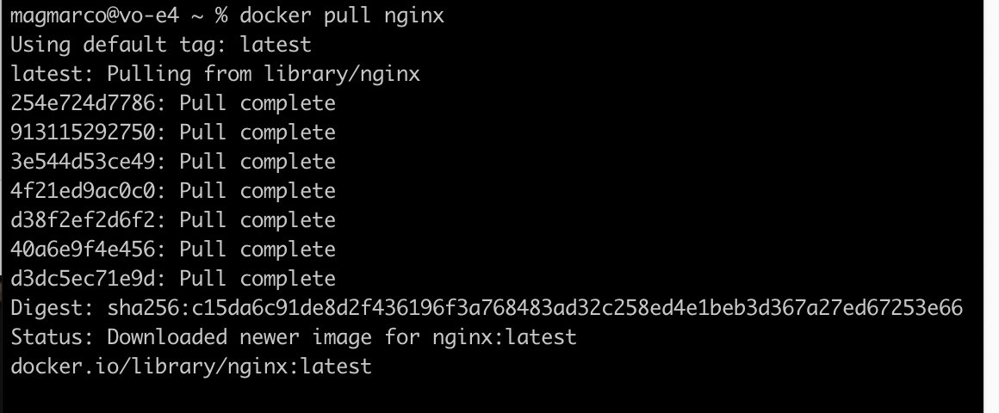

##### Проверь наличие докер-образа через `docker images`.

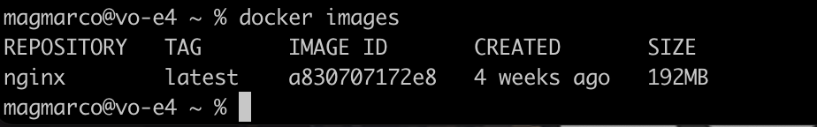

##### Запусти докер-образ через `docker run -d [image_id|repository]`.

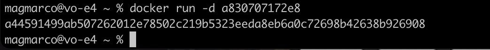

##### Проверь, что образ запустился через `docker ps`.

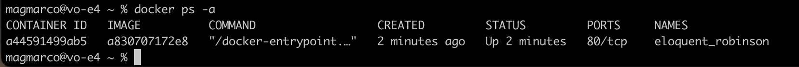

##### Посмотри информацию о контейнере через `docker inspect [container_id|container_name]`.

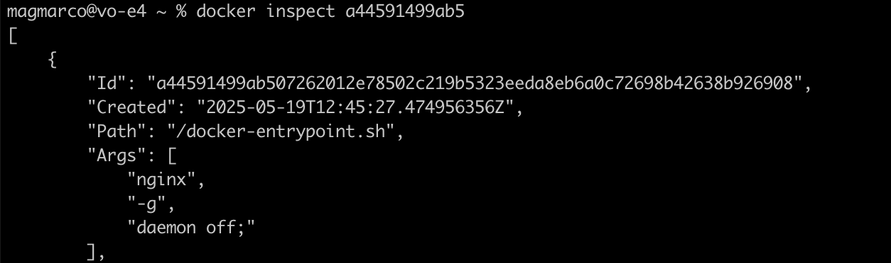

##### По выводу команды определи и помести в отчёт размер контейнера, список замапленных портов и ip контейнера.

- Размер контейнера.

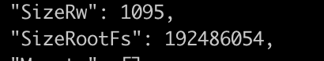

- Список замапленных портов.

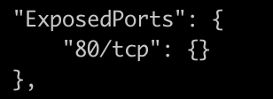

- ip контейнера.

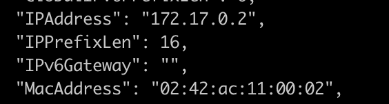

##### Останови докер контейнер через `docker stop [container_id|container_name]`.

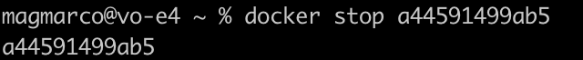

##### Проверь, что контейнер остановился через `docker ps`.

##### Запусти докер с портами 80 и 443 в контейнере, замапленными на такие же порты на локальной машине, через команду *run*.

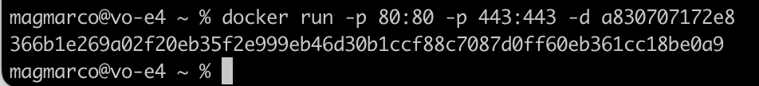

##### Проверь, что в браузере по адресу *localhost:80* доступна стартовая страница **nginx**.

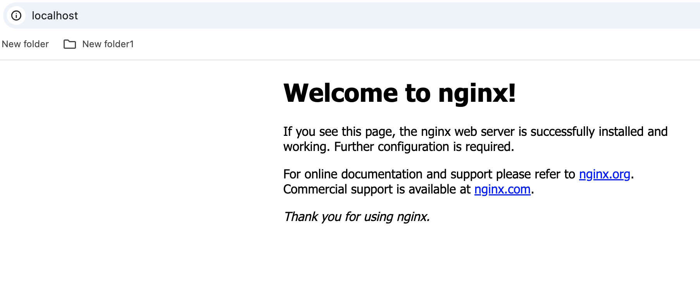

##### Перезапусти докер контейнер через `docker restart [container_id|container_name]`. Проверь любым способом, что контейнер запустился.

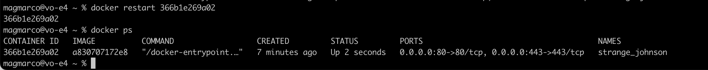

## Part 2. Операции с контейнером

**== Задание ==**

##### Прочитай конфигурационный файл *nginx.conf* внутри докер контейнера через команду *exec*.

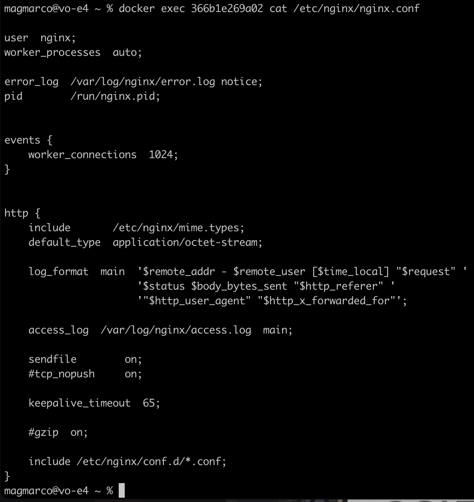

##### Создай на локальной машине файл *nginx.conf*.

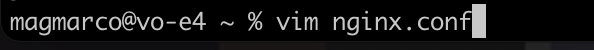

##### Настрой в нем по пути */status* отдачу страницы статуса сервера **nginx**.

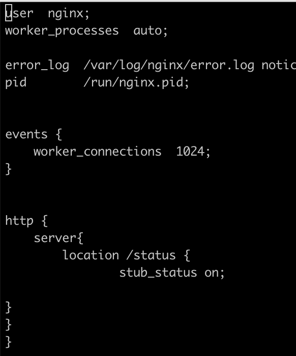

##### Скопируй созданный файл *nginx.conf* внутрь докер-образа через команду `docker cp`.

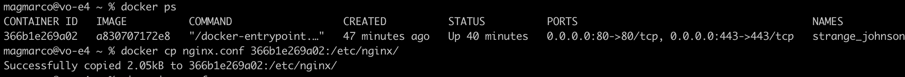

##### Перезапусти **nginx** внутри докер-образа через команду *exec*.

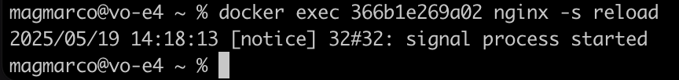

##### Проверь, что по адресу *localhost:80/status* отдается страничка со статусом сервера **nginx**.

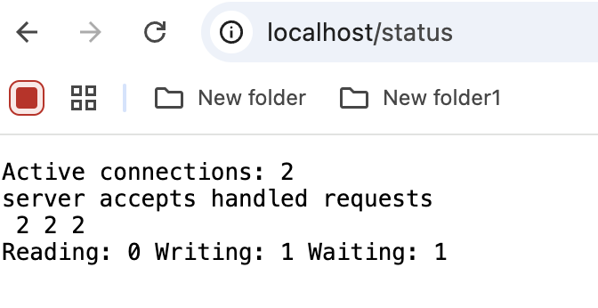

##### Экспортируй контейнер в файл *container.tar* через команду *export*.

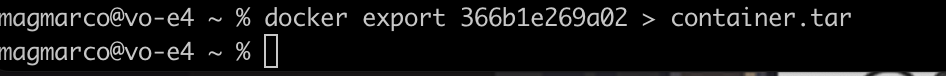

##### Останови контейнер.

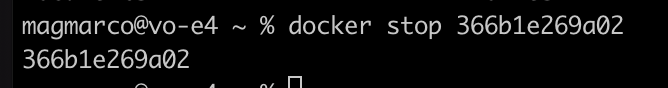

##### Удали образ через `docker rmi [image_id|repository]`, не удаляя перед этим контейнеры.

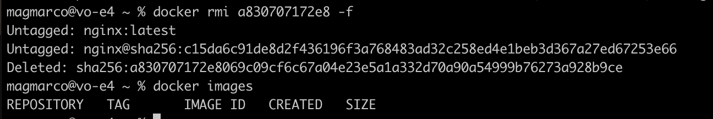

##### Импортируй контейнер обратно через команду *import*.

##### Запусти импортированный контейнер.

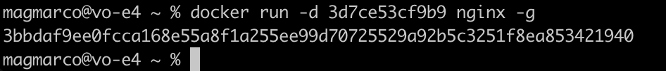

##### Проверь, что по адресу *localhost:80/status* отдается страничка со статусом сервера **nginx**.

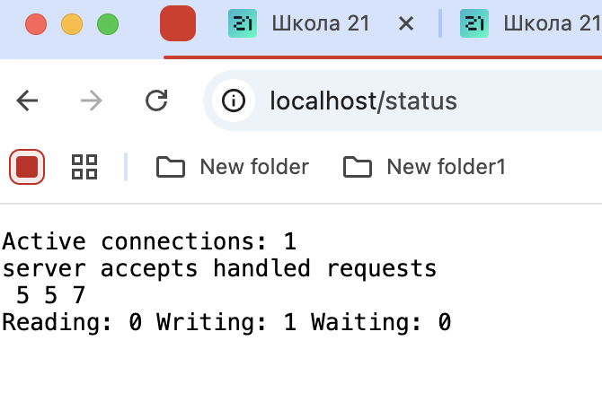

## Part 3. Мини веб-сервер

**== Задание ==**

##### Напиши мини-сервер на **C** и **FastCgi**, который будет возвращать простейшую страничку с надписью `Hello, World!`.

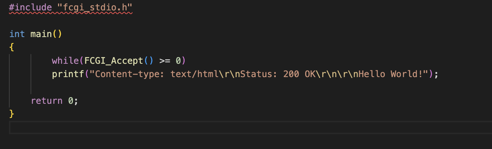

##### Запусти написанный мини-сервер через *spawn-fcgi* на порту 8080.

- Напишем докер-файл, который загрузит нужные библиотеки и скопирует мини-сервер внутрь контейнера.

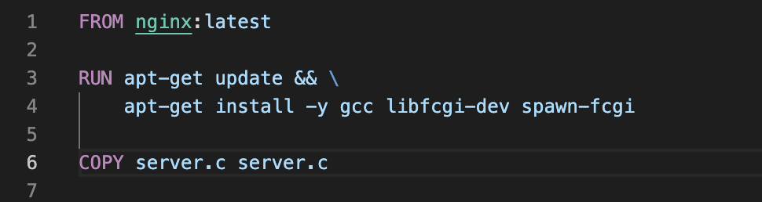

- С помощью команд `docker build -t test .` `docker run --rm -d -p 80:80 --name test -it test bash` запустим контейнер. Перейдем внутрь контейнера, воспользуясь `docker exec -it test bash`.

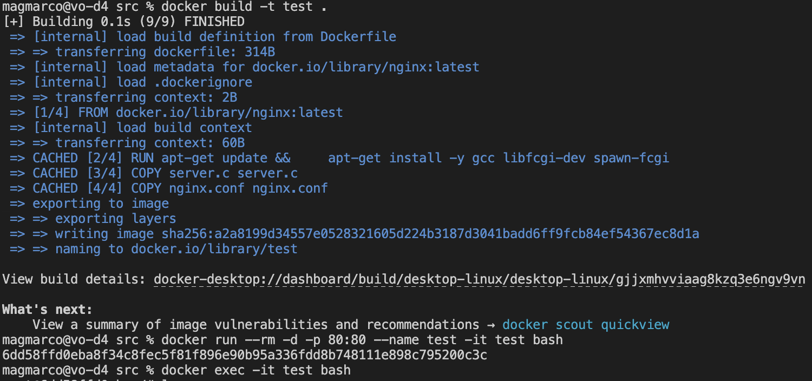

- Запускаем мини-сервер.

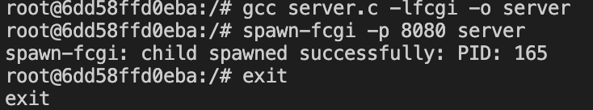

##### Напиши свой *nginx.conf*, который будет проксировать все запросы с 81 порта на *127.0.0.1:8080*.

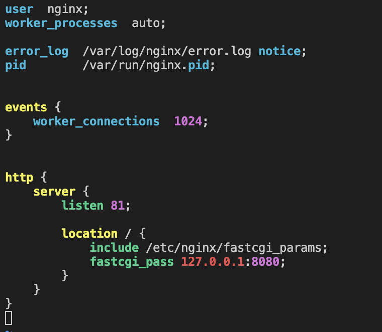

##### Запусти локально **nginx** с написанной конфигурацией.

- Запустим nginx локально.

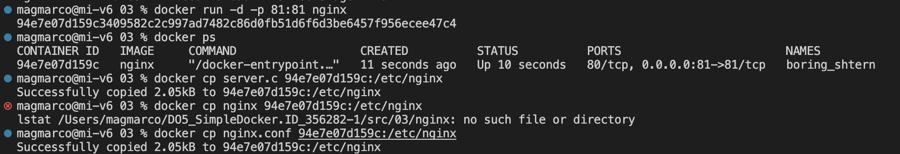

- Перезапустим nginx внутри контейнера.

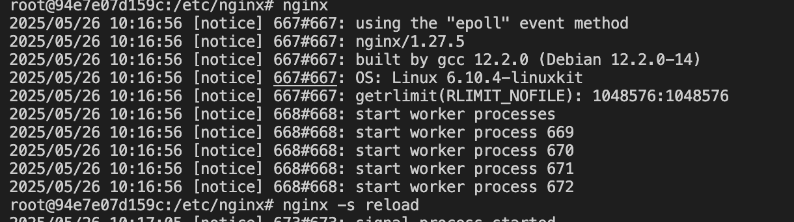

- Запустим написанный мини-сервер через spawn-fcgi.

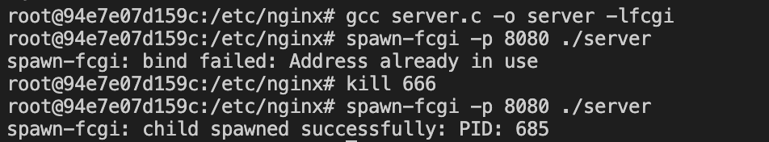

##### Проверь, что в браузере по *localhost:81* отдается написанная тобой страничка.

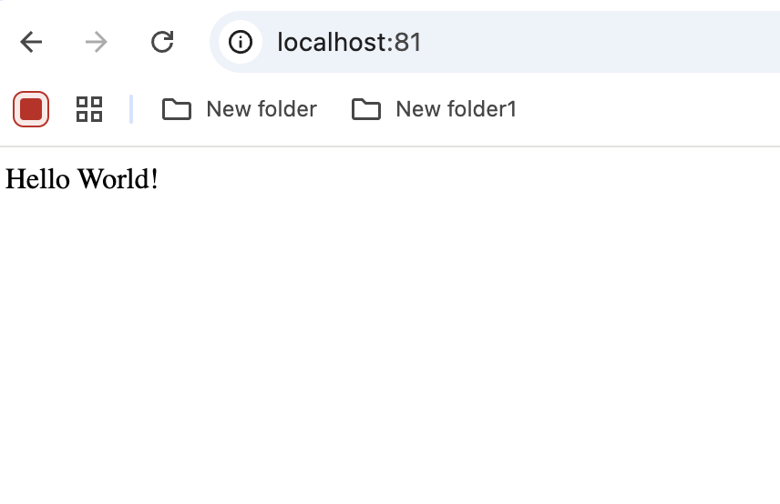

## Part 4. Свой докер

**== Задание ==**

#### Напиши свой докер-образ, который:
##### 1) собирает исходники мини сервера на FastCgi из [Части 3](#part-3-мини-веб-сервер);
##### 2) запускает его на 8080 порту;
##### 3) копирует внутрь образа написанный *./nginx/nginx.conf*;
##### 4) запускает **nginx**.

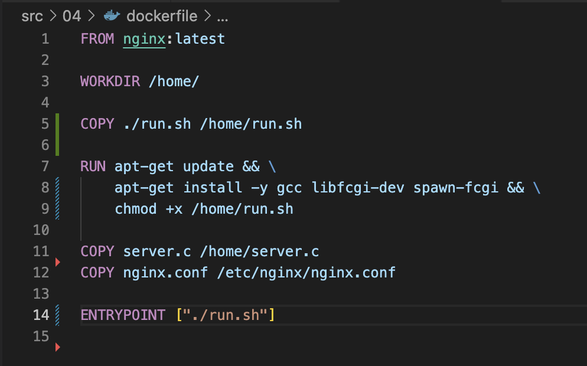

##### Собери написанный докер-образ через `docker build` при этом указав имя и тег.

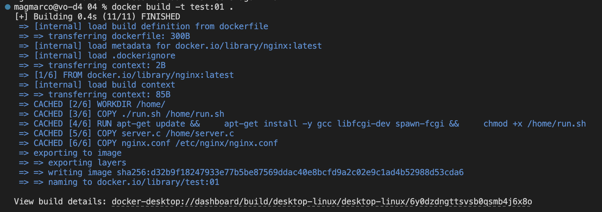

##### Проверь через `docker images`, что все собралось корректно.

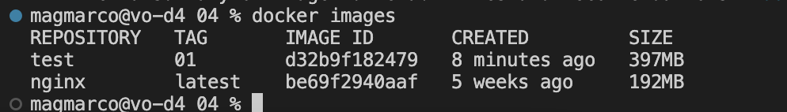

##### Запусти собранный докер-образ с маппингом 81 порта на 80 на локальной машине и маппингом папки *./nginx* внутрь контейнера по адресу, где лежат конфигурационные файлы **nginx**'а (см. [Часть 2](#part-2-операции-с-контейнером)).

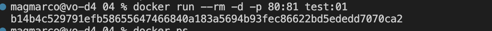

##### Проверь, что по localhost:80 доступна страничка написанного мини сервера.

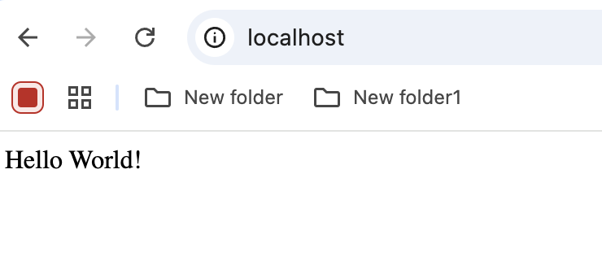

##### Допиши в *./nginx/nginx.conf* проксирование странички */status*, по которой надо отдавать статус сервера **nginx**.

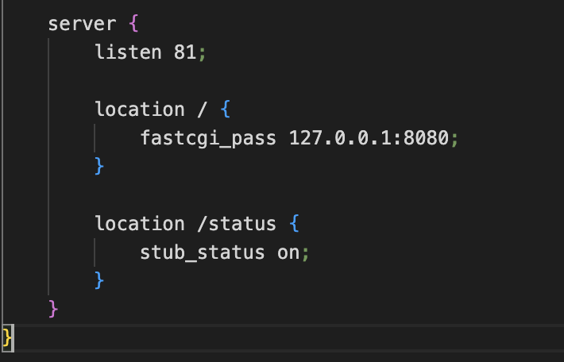

##### Проверь, что теперь по *localhost:80/status* отдается страничка со статусом **nginx**

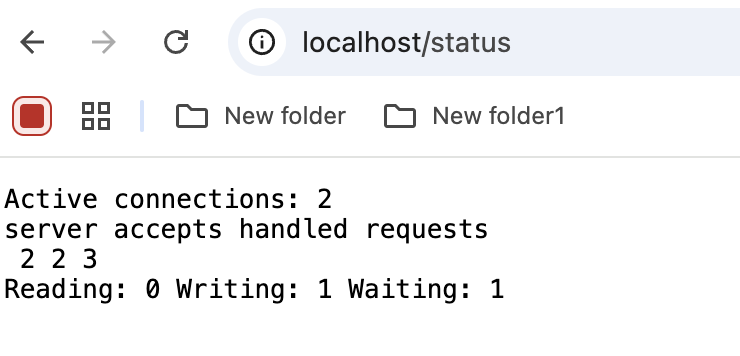

## Part 5. **Dockle**

**== Задание ==**

##### Просканируй образ из предыдущего задания через `dockle [image_id|repository]`.

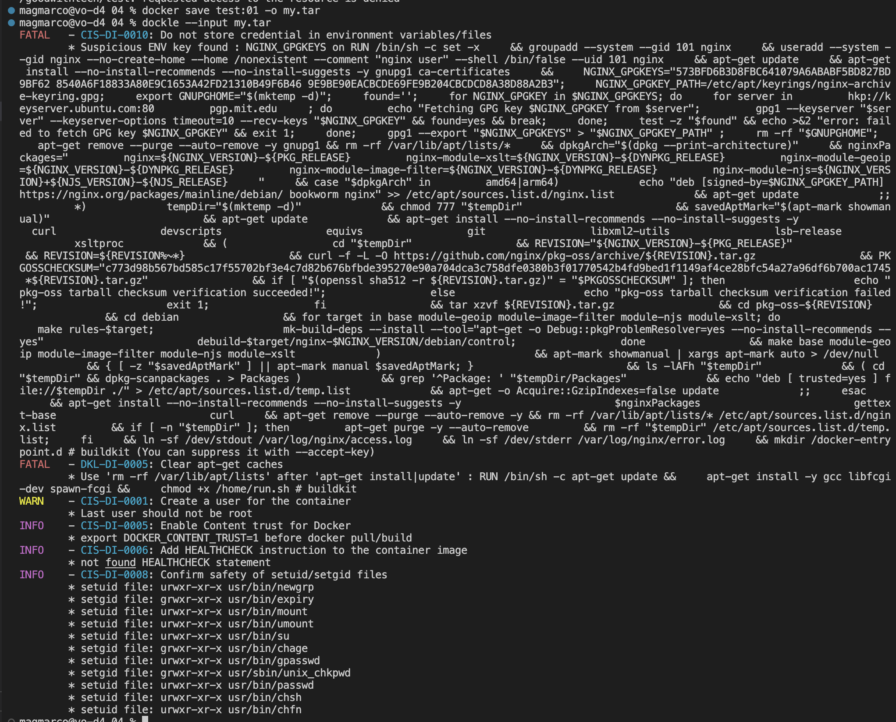

##### Исправь образ так, чтобы при проверке через **dockle** не было ошибок и предупреждений.

- Исправим образ.

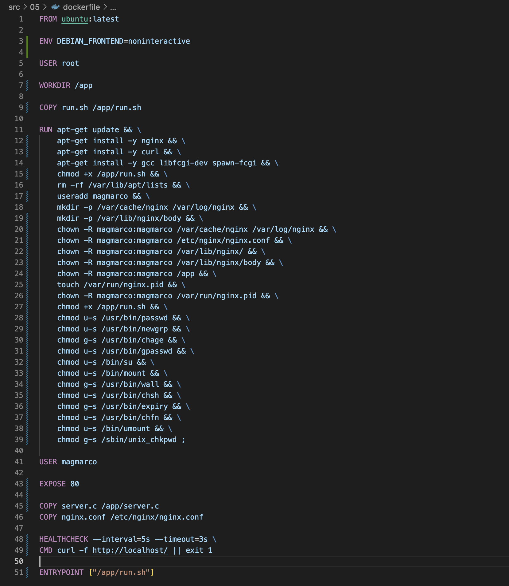

- Ошибок и предупреждений нет.

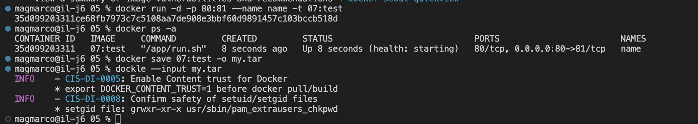

## Part 6. Базовый **Docker Compose**

**== Задание ==**

##### Напиши файл *docker-compose.yml*, с помощью которого:
##### 1) Подними докер-контейнер из [Части 5](#part-5-инструмент-dockle) _(он должен работать в локальной сети, т. е. не нужно использовать инструкцию **EXPOSE** и мапить порты на локальную машину)_.
##### 2) Подними докер-контейнер с **nginx**, который будет проксировать все запросы с 8080 порта на 81 порт первого контейнера.
##### Замапь 8080 порт второго контейнера на 80 порт локальной машины.

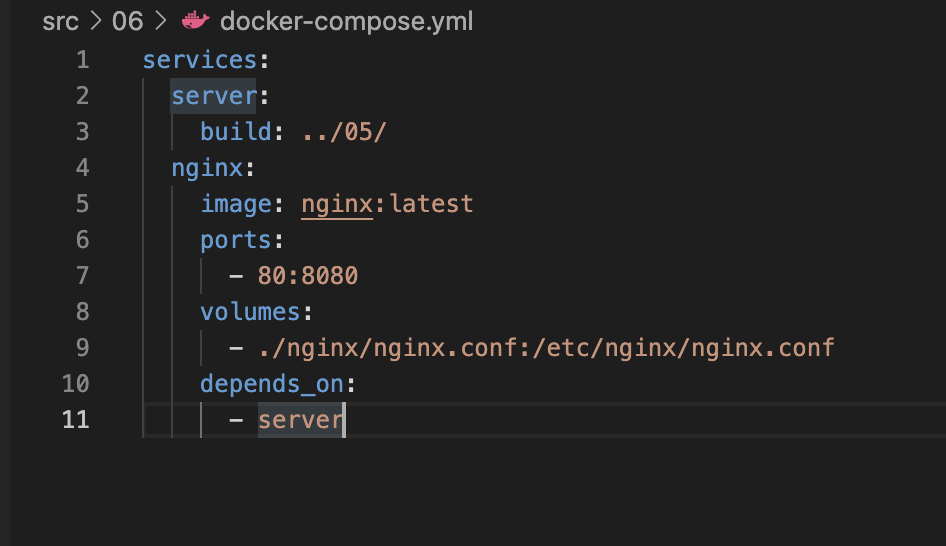

##### Собери и запусти проект с помощью команд `docker-compose build` и `docker-compose up`.

- Соберем проект с помощью `docker-compose build`.

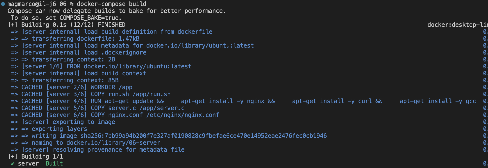

- Запустим проект с помощью команды `docker-compose up`.

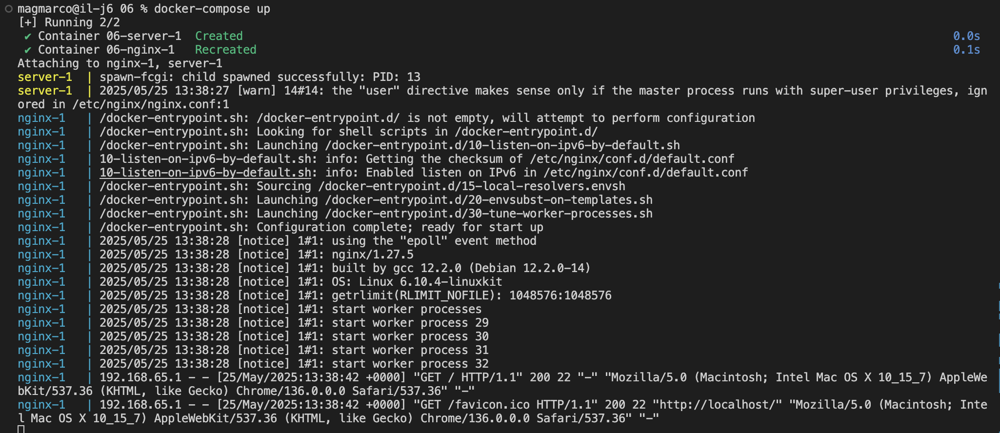

##### Проверь, что в браузере по *localhost:80* отдается написанная тобой страничка, как и ранее.

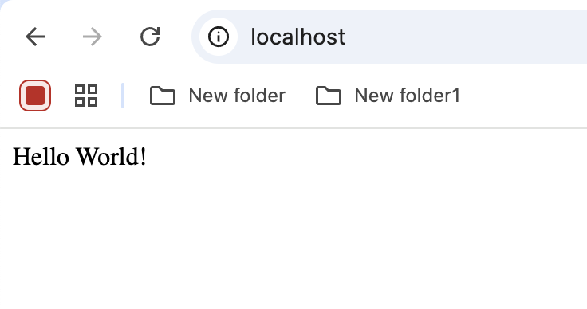

